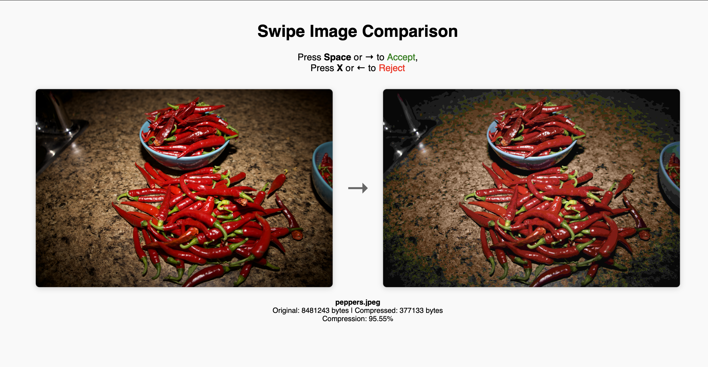
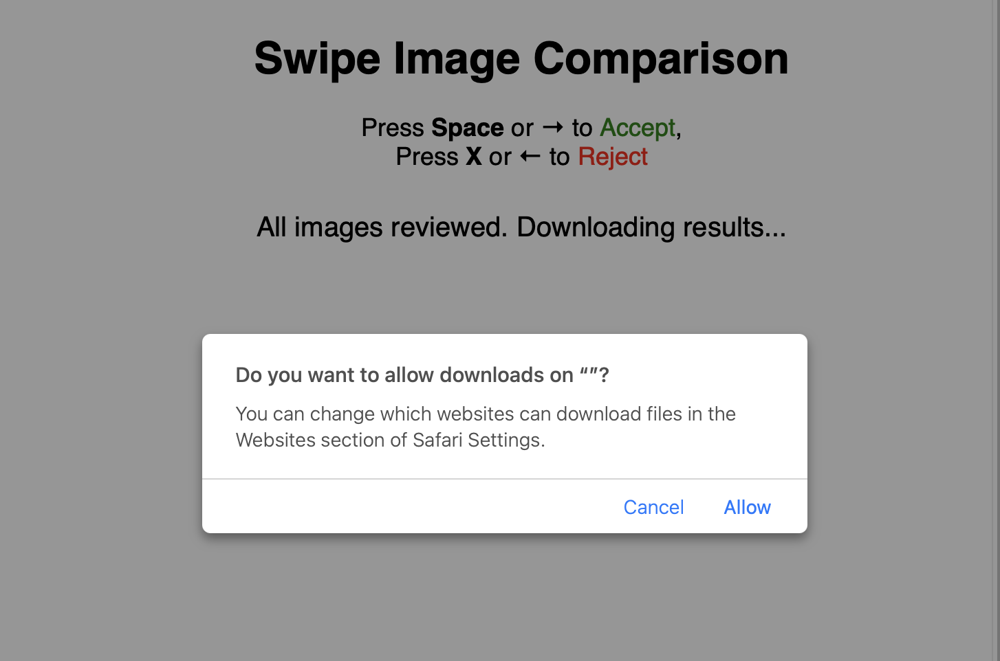
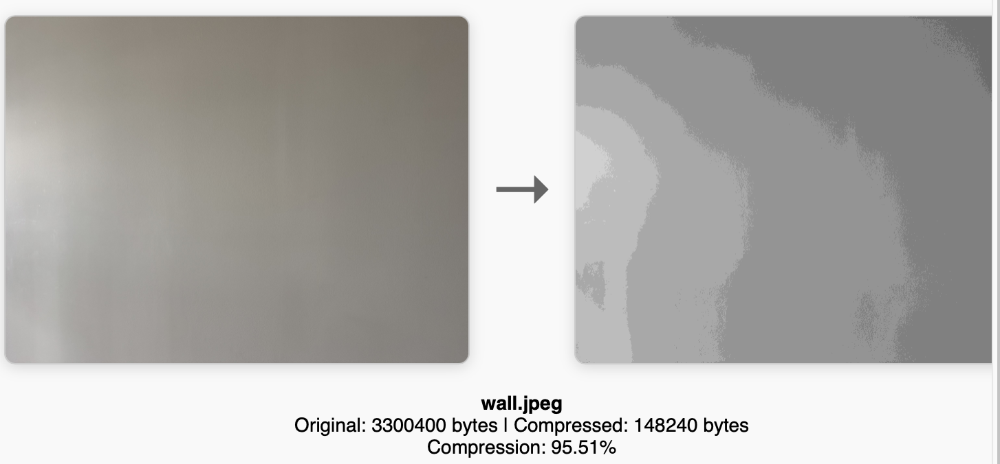
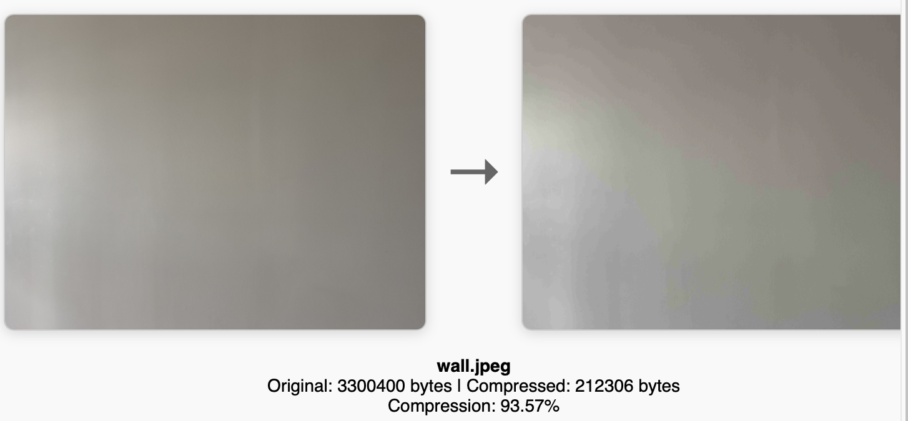
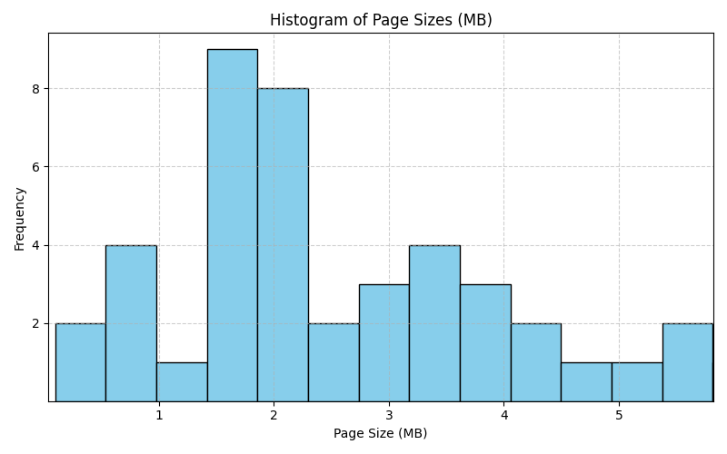
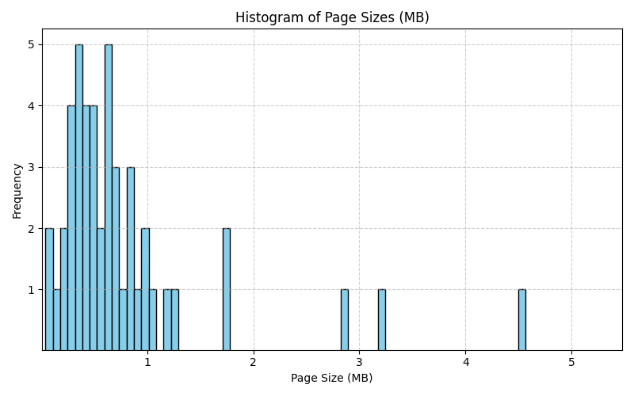
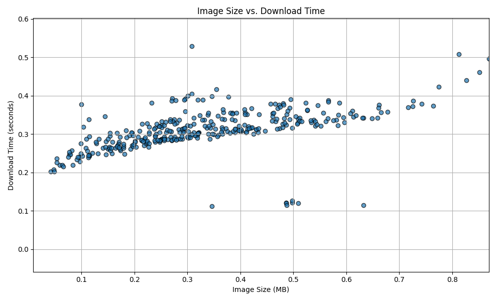
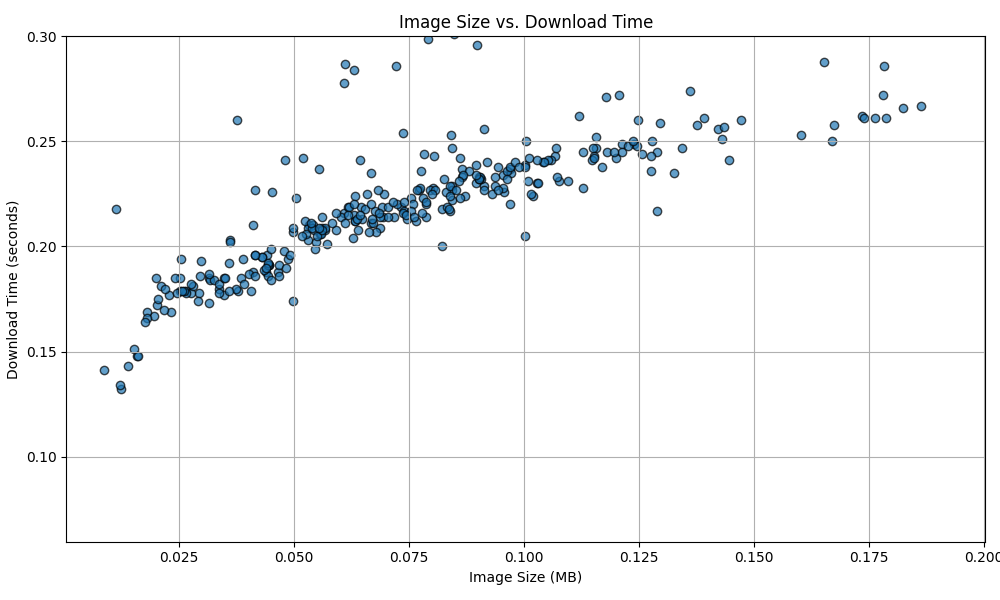
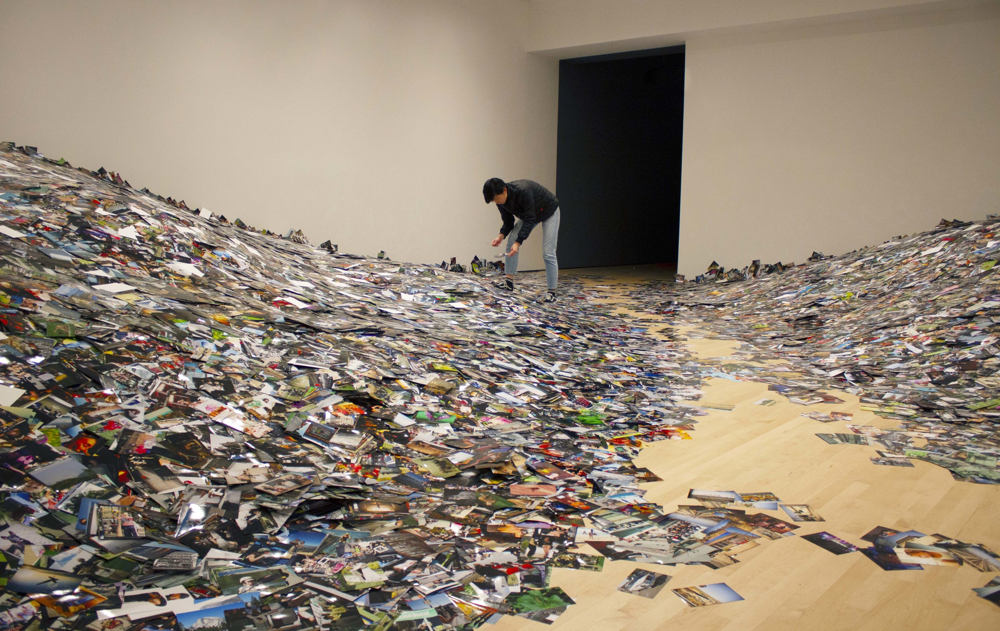

# Image Optimize

This repository was initially created to reduce the size of image files on some of my websites. However, the code was generalized to be used for any context where you have a folder with images that you want the sizes to be reduced.

Reducing a single image's size is trivial and can be done via many old and time tested tools like `ImageMagick`'s `convert` command:

```bash
convert <INPUT_FILE> -quality 10% <OUTPUT_FILE>
```

However, the problem gets less trivial when dealing with many pictures and the desire to visually verify that the reduced quality is the right one for all the pictures - a simple bash script with a for loop won't suffice.

The solution to this problem is motivated by discussing the _problem_ in the section directly below which motivates the code in this repository. The discussion will be a little verbose but I think necessary to fully explain the reasoning and design of the scripts. It will all read a little blog like which I hope you will enjoy as much as I did writing it. If you would like to skip ahead and start using the code then please go to the [How to use](#how-to-use) section.

## Problem 

The internet has a website obesity crisis: websites, when downloaded and viewed by clients in their browsers, are bigger than they need to be. From the article, [describing the "crisis"](https://idlewords.com/talks/website_obesity.htm) we observe how the average web page size has been growing in size from when in 2012 the average web page was `1Mb` and now is `3Mb`. I don't have the exact knowledge as to why this is happening, but outside of maybe an increase in video ads I think this is primarily due to the reason of sloppy websites.

I believe sloppy websites, or lazily made websites, become so because ther internet "consumers" are experiencing faster and better internet connections which causes the website "producers" to be less worried about their design. In Canada, in 2015, $60 monthly would get you `25 MBs` download speed and `250 GB` worth of data whereas in 2025 for the same price it is `150 MBs` and unlimited data. If your "consumer" has a really fast internet connection then why bother optimizing your site?

The author of the article, describing the crisis, funnily quips that text based websites should not exceed major famous works of Russian literature which in raw text file format are around `100Kb` in size (as in the the website's content can't possibly compare). However, nowadays text based web sites aren't "enough" as "consumers" demand images for engagement and attention retention.

According to this [article](https://www.speedcurve.com/blog/web-performance-page-bloat/), in 2017, images take up most of the web page site's data content. I checked one of my site's pages via a web page size checker tool (like [this one](https://toolsaday.com/seo/web-page-size-checker)) and discovered that it was 7Mb of data mainly made up of images which way exceeds the average of web page size 3mb.

Now comparing to the average is not necessarily appropriate as sometimes the average is actually a measure of "bare minimum". For example (and speaking of the actual obesity crisis) consider that in the 1950s the average American male weight was 146-166 pounds while today it is closer to 191-199 pounds. The average weight of someone today in the 1950s would be considered obese as visually such a person would really stand out in the crowd. If a modern, overweight, 250 pound, man  was trying to lose excess fat today, then the 191-199 average weight would be at least a target albeit a weak one as it's actually obese by previous standards.

Now the previous, 1950s, gold weight standard is more accetable as a "gold" standard as humans have not evolved that much over the past three quarters of a century since. It's not as if we all grew an extra pair of legs to justify the weight bump to 191-199 pounds (we did, on average, grow a few inches taller though). Most people, without any need for citations, will agree that it all has something to do with us eating way too much and so optimizing food consumption is logical.

It may not be as logical for the case of the average web page `3Mb` and web technology in general. Unlike, humans, computer and internet tech has experienced a massive evolution over the decades and so maybe `3Mb` is good enough? Phones and computers haven't grown a pair of legs (yet), but they are orders of magnitude faster and so maybe strong inflation (from `1Mb` in 2012) in webpage size is _okay_ as long as people can still see their social media feed and it all works... Furthemore, unlike most humans looking similar to each other, most web pages do not - some are plain text based sites while some are photo galleries - the variation adds flexibility to how we interpret what an appropriate average is for each of them.

No matter what the end average size will be for my web pages, I think it is still worth practicing optimizing for the sake of optimization and beauty. The advanced tech and fast internet speeds may be forgiving for my sloppy web pages, but I will see if I can improve.

Delivering a web page or any other product to a consumer that is optimized changes your approach to the product - you end up making it with more "love". Even if the consumer can't notice the difference with the end product, working on optimizing and making it better, changes your approach to it and your future endevours. Putting the effort in optimizing increases your "ownership" of the product and similar to owning your property (versus renting), you end up caring for the product more. 

Finally, I think optimization is a craft and muscle that can developed and practiced in many areas of life that can lead to unexpected opportunities like in the case of the RollerCoaster Tycoon where a developer worked hard to make a game in a primitive programming language that allowed his code to be super fast and create a complex and lag-less that took consumers by storm by making ["a game that was stunningly immersive and complex for its time"](https://weirdmarketingtales.com/how-rollercoaster-tycoon-made-19-6-million-in-1999/).

Now....I know what you're thinking: "wow... now that's a lot of mumbo jumbo for running a simple bash command to optimize all the images in a folder:"

```bash
convert <INPUT_FILE> -quality 10% <OUTPUT_FILE>
```

In the next section I will explain why a single command is not sufficient and that a more careful approach is required.

## Optimizing an image

What does it even mean to optimize an image for a website?

Consider the table below where on the left hand side you have the original image of hot peppers and on the right you have the image after running the bash command `convert <ORIGINAL> -quality 10% <UPDATED>`

|`<ORIGINAL>`|  `<UPDATED> 10%`      |
| ------------- | ------------- |
|  |   |

They look the same.... but are they? The original, left hand side, image is `6.3Mb` while the right hand side is about `10%` of that - `0.6Mb` - however, you can't really tell that just by looking. If your website hosts the right one then it would be losing almost `6Mb` in digital weight. What if we zoom into a specific part of the image represented by the yellow rectangle in the image below:


The zoomed section makes up a small portion of the overall image. Below is the zoomed portion for both the original and updated images.


|`<ORIGINAL>`|  `<UPDATED> 10%`      |
| ------------- | ------------- |
|  |   |

The updated, right hand side, compressed, image has less detail as it appears more pixelated (if you are reading article on mobile then perhaps it's not even easy to tell). However, the zoomed section makes up a really small portion of the overall image and so for the web viewer they can't really tell the difference between the `6.3Mb` and `0.6Mb` file if viewing the full, unzoomed, view. Thus, optimizing an image for the website means reducing the image size as much as possible without the viewer noticing. By reducing image size, you reducing the overeall website "weight" without the viewer noticing.

The image may not look too different in full view when reducing to `10%` of original file size. What about if we try `5%` to save even more space? Let's check it out below:


|`<ORIGINAL>`|  `<UPDATED> 5%`      |
| ------------- | ------------- |
|   |   |

We now get a `0.3Mb` file, but now it is clearly different from the original version as we can see the, updated, right hand side, image has a different overall hue from the original, left hand side, image along with missing details on the edges.

So in the case of the pepper picture, `5%` (`0.3Mb`) is too far, while `10%` (`0.6Mb`) is okay. Is the `10%` percentage a good rule of thumb? No, because every image is different. Consider the captivating image of my wall below:

|`<ORIGINAL>`|  `<UPDATED> 10%`      |
| ------------- | ------------- |
|  |   |

The original, left hand side, `3.3Mb` file gets shrunk `10%` ~ a `0.16Mb` file. With the shrunk file, the change is evident as the new version doesn't look like a wall anymore but some sort of low resolution countour map. Running:

```bash
convert <INPUT_FILE> -quality 10% <OUTPUT_FILE>
```

on a folder containing the pepper image _and_ the wall image would give me one picture I am satisfied with and one I am not. Therefore, running the bash command blindly is not sufficient - we need to visually verify if the optimization is ideal or not for each image. How do we do that? How do I do that on my website? First we will take an aside and learn about the specifics of my site.

## Jekyll site aside

My website is built using the open source site building [Jekyll](https://jekyllrb.com) tool. To explain to a non technical reader I would use a car analogy. Jekyll is the car factory, like say Toyota, and each user of the Jekyll software is a Jekyll-brand car owner. You can download a Jekyll website building tool (or car), for free anytime.

Since it is open source then it is equivalent to, as a driver, having full access to the schematics, design documents and manual of the entire car. If I need to get a new set of wheels then I can read up on that easily. The downside is that I need to do it myself - I am the mechanic.

Not all website building tools are open source meaning you usually must pay for their service. In exchange of not seeing the schematics, the car factory takes away the details and does them for you which is ideal for a non technical customer. You get to pay a mechanic for upgrades and running the car.

To "buy" a Jekyll car all you need is to know how to use the computer terminal. The following terminal commands will generate a very basic, vanilla website (see more [here]([Jekyll](https://jekyllrb.com))).

```bash
> gem install bundler jekyll
> jekyll new my-awesome-site
> cd my-awesome-site
> bundle exec jekyll serve
# => Now browse to http://localhost:4000
```

The vanilla website can be considered as a specific car factory's model or theme (like the Corrola model from Toyota). There are many many models to choose from, all free to download.

After your website is built via the Jekyll tool then it is equivalent to driving anywhere you want with your car. The Jekyll tool doesn't care what you do with your website or write on it just as the car factory doesn't really care how and where you drive.

Regardless of what model your car is, Jekyll designed all the themes / car-models such that it is very simple and standard to add-content / drive. Driving in one car model is basically the same in another car-model. This is what makes Jekyll attractive as the adding-content / driving is very similar while the themes / car-models can be very different. A Jekyll user can easily find a car of their flavour and drive where they want.

Social media websites are also similar to site generating tool like Jekyll as in the adding-content / driving mechanics are very straightforward. Whether you are making a post, or sharing pictures - these concepts are very standard and easy to pick up from facebook, twitter and others. For the analogy, if Jekyll is a car factory then social media websites are public transport - simple and easy to use and get around town but are restricted by the routes (like Twitter with character count in tweets) and you are subject to seeing advertisement and interacting with other passengers.

Like with owning a car, there is more hassle of at the very least of paying insurance and parking or the equivalent of figuring out how to host your Jekyll built site. This can be annoying enough for some people to not bother getting such a car and taking the bus instead. Furthremore, busses take popular and busy routes and have more traffic and opportunituy for you to share your content with others.

The most interesting part of Jekyll sites (at least to me) is that you can add your custom car mods (aka "Jekyll plugins") that make your ride more unique and interesting compared the default car-model / theme options. Don't like the stock factory colour? Paint it purple with pink flowers! Custom mods are made possible because the design and schematics are open source for eveyrone to see and figure out how to build upon. However, here oftentimes you really have to get your hands dirty with the terminal and have some skill.

In concluding this aside, I hope I have convinced you, the reader, to maybe explore Jekyll sites.

## Generic approach

In the previous section, I introduced what a Jekyll site is and Jekyll plugins. To solve the problem of optimizing images for my Jekyll site, I decided that I needed a Jekyll plugin that everytime I add a new image to my site it would automatically compress and process it. I initially found inspiration in the article [here](https://joshuahwang.dev/2021/06/28/image-resizing.html) for this approach and the code looked simple enough:

```ruby
require 'image_optim'

Jekyll::Hooks.register :site, :post_write do
  image_optim = ImageOptim.new
  image_optim.optimize_images!(Dir['_site/assets/images/*/*.*'])
end
```

I ran into the same realizations as the author - that it would significantly impact the website build process and lead to slower iteration. I decided to create another tool that would work outside the plugin framework. I decided to write a tool that takes a generic folder of images, optimizes them and provides a visual way of verifying the result of each image optimized image. Since it is generic, this folder does not have to be your Jekyll site's photo / media-asset folder, but could be any other folder you wish to optimize. The downside to the generic approach is that it won't rerun automatically everytime I modify my Jekyll site, but since I don't make that many posts and add that many images...it's no big deal.

To assit in creating this tool, I used a minimal code approach - I mainly used chatgpt which was very effective in coming up with a visual way of comparing original to optimized images. Let's see how the scripts work.

## How to use

As a demonstration, in the root of this repository, you have a `test_folder` containing the aformentioned pepper and picture of the wall. Let's optimize these images.

### 1. Modify the `script/settings.rb` file

The optimization library relies on the [image_optim](https://github.com/toy/image_optim) library. They library provides code that consumes and image and produced an optimized version. We must provide the settings. For pngs we have:

```ruby
png_compression_options = {
    # disabling all but one png library that has quality option
    :optipng=> false,
    :oxipng => false,
    :pngcrush=> false,
    :pngout=> false,
    :pngquant=>
    {
        :allow_lossy=> true,
        :quality => 5..5
    }
}
```

and for jpegs we have:

```ruby
jpeg_compression_options = {
    # disabling all but one jpg library that has max_quality option
    :jpegrecompress => false,
    :jhead=> false,
    :jpegtran=> false,
    :jpegoptim=>
    {
        :allow_lossy=> true,
        :max_quality => 5
    }
}
```
For both pngs and jpegs, `image_optim` provides a variety of tools to optimize your images. We restrict to `pngquant` and `jpegoptim` as they allow us to choose a number between `0..100` from lowest to highest quality for the `quality`/`max_quality` settings. Let's choose `5` for now as we want to really optimize things!

### 2. Optimize the photos

Use the settings from the previous step to optimize:

```bash
> cd scripts
> ruby sync_and_optimize.rb ../test_folder
Optimizing 2 image(s)...
Done.
```

After the script has ran you now have a new folder at root level called `test_folder_backup` containing the original photos as backup in case we are not happy with our optimization.

### 3. Quality checking our results

Generate a local html page to visually check the optimized photos.

```
> cd scripts
> ruby compare_images.rb ../test_folder_backup ../test_folder
✅ Swipe-based HTML review generated: swipe_compare_20250707_172328.html
```

You will see an html `swipe_compare_20250707_172328.html` within the `scripts` directory. Double click to see the page below in your browser



To operate, use the arrow keys or the space and x button to either reject or accept the photo. The transition arrow in the middle shows that the left, original, image was optimized to the one on the right. The text in the middle, below the image gives you compression stats.

Below is the gif demonstrating how our quality checker works. 


We first accept the pepper image compression results by pressing space key or left arrow which makes the screen turn green. After accepting, the progress bar at the bottom shows us that we are on our way to the next image. We then see the poor compression of the wall image and so reject it via right arrow key (or x) which makes the screen go red. The green/red is a visual cue of our choice while the progress bar at the bottom lets us know how far we have come so far in checking our images (as we may be processing a lot of images).



Once we have sorted all the photos, we Download the results file (`results.txt`) which is a text file storing our reject/accept choices. For our case it would look like:

```
peppers.jpeg accepted
wall.jpeg not accepted
```

Move this file to the `test_folder_backup` directory called `results.txt`:

```bash
> cd scripts
> mv ~/Downloads/results.txt ~/test_folder_backup/results.txt
```

### 5. Iterate

The reason we distinguish between `accepted` and `not accepted` is that we already accepted the pepper image and no longer have to compress it again or visually analyse - thus saving time. It was the wall compression that was unsatisfactory: 



We can now go to step 1 of this guide and modify `script/settings.rb` to a higher setting of `15` instead of `5` in hopes that the optimized wall image will be more wall like and less like a contour map. 
```ruby
    :jpegoptim=>
    {
        :allow_lossy=> true,
        :max_quality => 15
    }
```

We will run the previous steps again

```bash
> cd scripts
> ruby sync_and_optimize.rb ../test_folder
Optimizing 1 image(s)...
Done.
> ruby compare_images.rb ../test_folder_backup ../test_folder
✅ Swipe-based HTML review generated: swipe_compare_20250707_195721.html
# OPEN AND ANALYSE THE RESULTS in swipe_compare_20250707_195721.html
> mv ~/Downloads/results.txt ~/test_folder_backup/results.txt
```

After setting to `15` we got a better result hatn before as seen in the image below which in this case we will choose to accept 



The idea of iteration is that you first start with the lowest possible `:max_quality =>` setting in `script/settings.rb` and accept all images that under that quality look acceptable to the eye. Then you keep increasing the `:max_quality =>` to get the rest of the images that don't. This is a greedy approach because by starting at the lowest `:max_quality =>` you try to compress as much as possible until the optimized images look good.

The file `results.txt`, stored in the `_backup` directory, acts as a checkpoint of your results so that you can pause and come back later. Furthermore, if you end up adding new images to your folder sometime in the future then you can repeat the process without revisiting the already optimized images.

## Conclusion

Despite the long and fancy write up of this README, the series of scripts presented in this repository are simply used to reduce the size of a bunch of files on a hard drive: nothing fancy. As someone who has been coding for over a decade this is a very basic task that fits into the general category of computer programming housekeeping: move some files here, transform some files over there and delete some files elsewhere. What separates this specific set of scripts is how I generated them.

Each of the ruby scripts were generated via chatgpt over the course of 10 minutes of back and forth chatting with the AI bot to produce the exact script I need. The ruby script that generated the comparison tool `compare_images.rb` was very impressive for me as it allowed me to create a beautiful tool in assiting in the boring task of verifying that the optimization quality is good. If you had asked me to optimize my images a few years ago, I would probably have pushed back and said: "is it worth the development time of the app?"." However, now that development time is being reduced so drastictly - it's an easy "let's do it".

I did develop a similar comparison/analysis tool (without chatgpt) years prior - https://github.com/mannyray/ImageTagger and the development was slow as I wasn't an expert in UI. I'm still not a UI expert, but that is no longer that important. Even with languages I was more expert in, I still had to do a lot of remembering in the past like "hey...how do I open a file in python again?" and after googling, stackoverflow.com would let me know it's:

```python
with open('filename.txt', 'r') as file:
    contents = file.read()
    print(contents)
```
now the query to chatgpt be can be a little more complicated than that:

```
Write a python script that will open a text file where the data
is formatted like .... and plot me a histogram with x axis labeled...
```

Overall, I am very grateful to have been able to develop this app and to use chatgpt to help makes things more faster and possible given my time. I will be considering what other stuff I can now do faster.

### What about the numbers?

Almost forgot - sorry. Can't write a conclusion without discussing some results! The code ran on one of my sites where I was able to reduce 546 images from `308Mb` to `65Mb` - an almost `80%` reduction in data. A sample image went from `364Kb` to `113Kb`. For reducing required data for hosting - this is a great improvment! The site was designed in a way where each web page on the site is like a page of a book so an engaged user would be expected to see all the images on the web pages and thus (at least their computer) would definitely feel the savings in reduction of image size.

The average page size went from `4.9015 MB` to `1.0305 MB`. The table below shows a histogram of the page sizes from before to after optimization. For the left hand side plot, previous site, there were a few outlier  pages that were over `5Mb` which is why I chose `5Mb` x axis limit for the "Page Size (MB)" (to just show the general, outlier free, trend). On the right hand side image, for the updated pages, I kept the `5Mb` x axis limit for consitency, but now get to see some of those `5Mb+` outlier pages making their way into the histogram. Regardless of the outliers, the general trend is that now, most pages are under `1Mb` in size once we optimized the images.


| Previous    | Current |
| -------- | ------- |
|   |    |

Now that our images are smaller in size, I wondered if there was another unintended consequence: speed. Even though my internet connection remains the same, perhaps making the image smaller makes it easier/faster for the site hosting server to send them out to users even when our file is changing from something like `300kb` to `100kb` in size. I ran a script downloading all the images from my site and stored the relation between download time and file size. I plotted a scatter below, for the unoptimized site, where each data point represent a "download time" VS "file size". There is a trend that as a file gets bigger (moving to the right of the scatter plot) then the download time gets bigger (moving to the top of the scatter plot).



Excluding outliers, for my old unoptimized site, the average file size was `0.3204 MB` with average download time of `0.3072 sec`. Once optimized, the average file size was `0.0905 MB` while the average download time was now `0.2279 sec`. As the average file size went down `71%` in size, the time for it to be delivered from server to browser went down `26%` in time. Not only are we reducing file size but also download time - another win!

Below is the equivalent scatter plot maping download size VS speed, but for the optimized site. 



## The ultimate optimization!

To avoid having to optimize photos in the first place, perhaps we can consume _and_ produce less photos to reduce our "digital pollution". An image below is from an [art exhibit](https://www.erikkessels.com/24hrs-in-photos) where the artist summarizes his show as:

> We’re exposed to an overload of images nowadays. This glut is in large part of the result of image-sharing sites like Flickr, networking sites like Facebook and Instagram and picture-based search engines. Their contact mingles the public and private, with the very personal being openly displayed. By printing 350.000 images, uploaded in a twenty-four hours period, the feeling of drowning in representations of other peoples’ experiences is visualized. 


